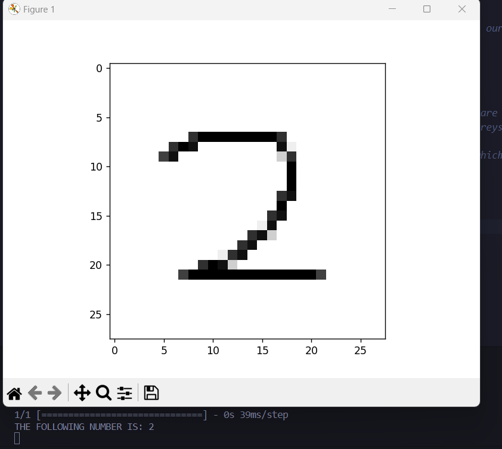

Hi! This is my neural network model. I am using Keras with tensorflow backend. My model uses labelled data on numbers to then predict a number given to it as a picture. The model here is in the handwritten.model
- The model is first trained using TensorFlow and keras and stored locally as the 'model' variable, NOTE: in the main file this code is commented out as I already trained the model but you will need to uncomment lines 7-25 and comment out lines 28-42, then comment out lines 7-25 and uncomment out lines 28-42 these lines will give the output.
- Then you can feed the model any image of a picture and it will predict the number. You can also loop through all the images in the directory and predict the number for each one. NOTE: some images are provided and by default, these are ran through the model you might need to change the path.
- please note that all images must be 28x28 pixels in size. the image can be hand drawn or a picture of a number.
- you can change this model and play with the code however you like, some pictures are provided with the project but, you will have to download some Python libraries to run the project. the model is already trained but you can train it on different data and make it even better

Click here to watch this video I made on neural networks that covers the absolute basics of how they work and how they can predict images from simple pixels of an image: https://youtu.be/E45j2p9Ktpw

